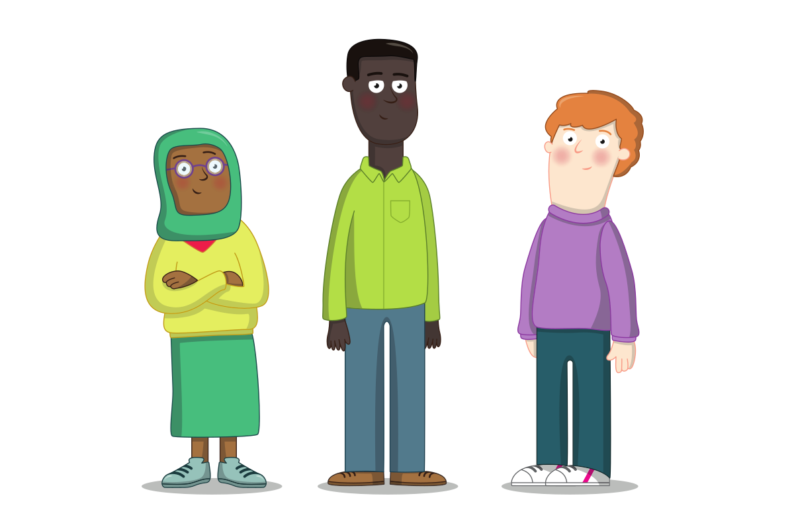

## Abuse and disclosures

A vast majority of young people take part in our clubs without encountering abuse. However, it is important that volunteers are aware of what to do when they become aware of abuse either through observation or through a young person telling you about abuse (disclosure). Most Raspberry Pi Foundation clubs create an environment in which many young people feel particularly comfortable, which can help encourage disclosures at the club.

{:target='_blank'}

Child abuse is generally categorised as neglect, physical abuse, emotional abuse, sexual abuse, or radicalisation. Other aspects to be aware of include peer abuse, organised abuse, and online abuse.

### Types of abuse: neglect

Neglect can be defined in terms of an omission, where a young person suffers significant harm or impairment of development by being deprived of food, clothing, warmth, hygiene, intellectual stimulation, supervision and safety, attachment to and affection from adults, and/or medical care.

[Further resources and definition from the NSPCC (UK)](https://www.nspcc.org.uk/what-is-child-abuse/types-of-abuse/neglect/){:target='_blank'}

### Types of abuse: physical abuse

Physical abuse of a young person is that which results in actual or potential physical harm from an interaction, or lack of interaction, which is reasonably within the control of a parent or person in a position of responsibility, power, or trust. There may be single or repeated incidents.  

Physical abuse can involve:

* Severe physical punishment
* Beating, slapping, hitting, or kicking
* Pushing, shaking, or throwing
* Terrorising with threats

[Further resources and definition from the NSPCC (UK)](https://www.nspcc.org.uk/what-is-child-abuse/types-of-abuse/physical-abuse/){:target='_blank'}

### Types of abuse: emotional abuse

Emotional abuse is normally to be found in the relationship between a parent, guardian, or caregiver and a young person rather than in a specific event or pattern of events. It occurs when a young person’s needs for affection, approval, consistency, and security are not met. It is rarely manifested in terms of physical symptoms.

For example:

* Persistent criticism
* Sarcasm or hostility
* Emotional unavailability
* Use of unreasonable or harsh disciplinary measures

[Further resources and definition from the NSPCC (UK)](https://www.nspcc.org.uk/what-is-child-abuse/types-of-abuse/emotional-abuse/){:target='_blank'}

### Types of abuse: sexual abuse

Sexual abuse occurs when a young person is used by another person for their gratification or sexual arousal, or for that of others. This doesn't have to be physical contact and it can happen online.
Sometimes the young person won't understand that what's happening to them is abuse. They may not even understand that it's wrong.

[Further resources and definition from the NSPCC (UK)](https://www.nspcc.org.uk/what-is-child-abuse/types-of-abuse/child-sexual-abuse/)

### Types of abuse: radicalisation

Young people at risk of radicalisation may be victims of other forms of abuse, such as bullying or discrimnation, that make them easy targets for extremists.

Radicalisation can be difficult to notice, as it is similar to some normal teenage behaviours. Here are some signs that a person or group might be attempting to radicalise a young person:

- The young person isolates themselves from family and friends
- The young person talks as if from a scripted speech
- The young person is unwilling or unable to discuss their views
- The young person shows a suddenly disrespectful attitude towards others
- The young person has increased levels of anger
- The young person is increasingly secretive, especially around internet use

[Further resources and definition from the NSPCC (UK)](https://www.nspcc.org.uk/keeping-children-safe/reporting-abuse/dedicated-helplines/protecting-children-from-radicalisation/)

--- save ---

Ensure you're logged into your Raspberry Pi Foundation account to save your progress, otherwise your completion will not be recorded. Use the <a href="https://my.raspberrypi.org/login">'Log in'</a> link in the navigation menu to log in.

