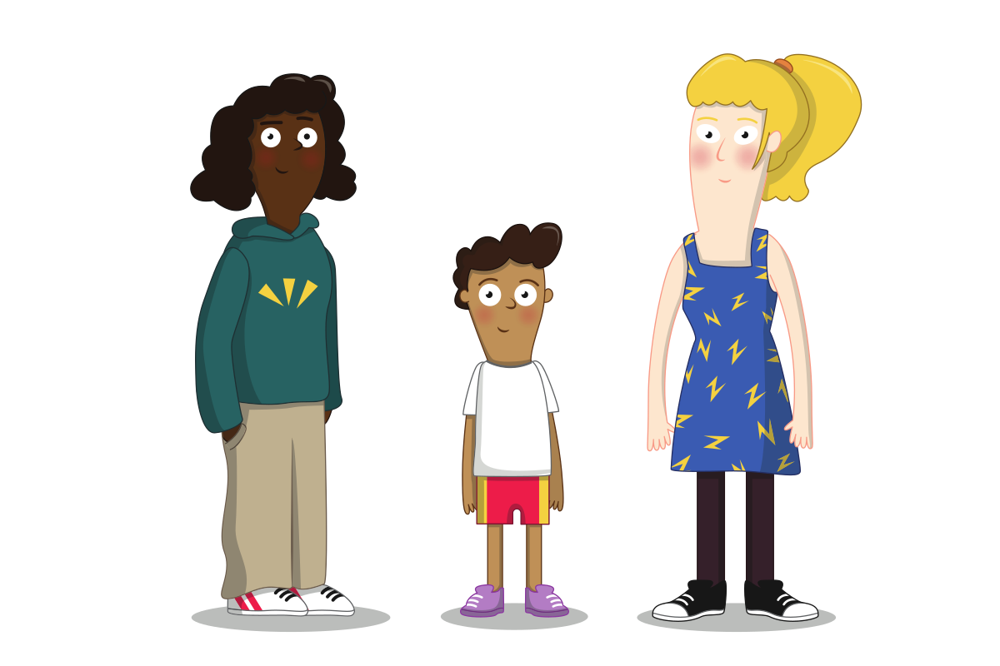

## What to do if…

If you have a concern about a young person or if a young person discloses abuse to you, it is important to be prepared and as a club to have a reporting procedure. Your reporting procedure may be linked to the venue you operate out of.

In this next section we will give you some tips, sample scenarios and sample reporting procedures for your club. We would recommend that you talk about these with your fellow volunteers.

If you have any doubts then you can fill out our [online safefuarding form to get advice and support](https://form.raspberrypi.org/f/safeguarding-concern-form){:target='_blank'}

### What to do if a child discloses abuse to you

1. React calmly, as a serious reaction may alarm the young person and compound feelings of anxiety and guilt,
1. Listen carefully and attentively; take the young person seriously,
1. Reassure the young person that they have taken the right action in telling you,
1. Do not make false promises; particularly regarding secrecy. 
1. Explain that if what they are going to tell is serious then you will have to tell another person.
1. Do not ask the young person to repeat the story unnecessarily,
1. Ask questions only for the purpose of clarification.  Be supportive, but do not ask leading questions or seek intimate details beyond those volunteered by the child,
1. Check with the young person to ensure that what has been heard and understood by you is accurate, and
1. Do not express any opinions about the alleged abuse or abuser.r

### What to do after a child discloses abuse to you

1. Record the conversation.
1. Sign and date any written records.
1. Pass the information to the person responsible for Child Protection at the venue. They will be able to guide you on next steps, which will include writing down what you have heard as accurately as possible.
1. If the child is at immediate risk, the person responsible for Child Protection at the venue should contact the police. 
1. Treat all information confidentially, sharing only with those who have a right to hear.
1. If it is not possible to report your concern to the venue, please contact safeguarding@raspberrypi.org and a member of the team will advise you.

Remember if you are unsure about a disclosure or need support, you can get in touch with the Raspberry Pi Foundation at any time.

### What to do if you notice signs of abuse

1. Record any signs in detail.
1. Sign and date any written records.
1. Pass the information to the person responsible for Child Protection at the venue. They will be able to guide you on next steps, which will include writing down what you have heard as accurately as possible.
1. If the child is at immediate risk, the person responsible for Child Protection at the venue should contact the police. 
1. Treat all information confidentially, sharing only with those who have a right to hear.
1. If it is not possible to report your concern to the venue, please contact [safeguarding@raspberrypi.org](mailto:safeguarding@raspberrypi.org){:target='_blank'} and a member of the team will advise you.

Remember if you are unsure about a disclosure or need support, you can get in touch with the Raspberry Pi Foundation at any time.
